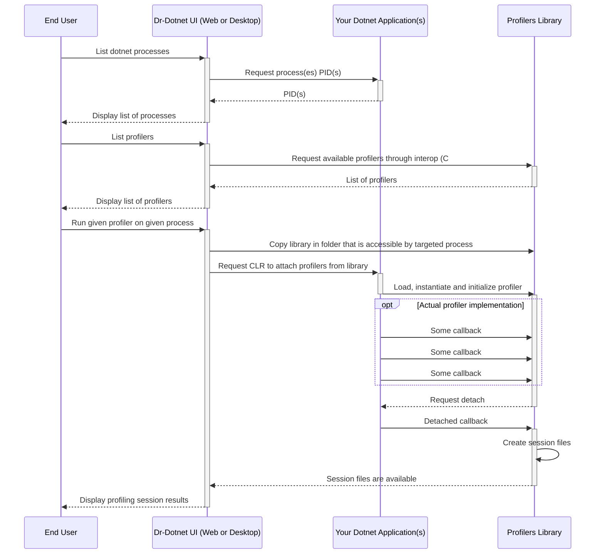

# Architecture

## Overview

The .NET Profiling API is accessible via COM interop (cross-platform thanks to the Platform Adaptation Layer) and allows little overhead profiling compared to other methods while giving a wide range of possibilities for profiling purpose. Perfview uses this API (on top of ETW) however it does it from managed code calling mocked COM objects written in C#.     

In this Dr-Dotnet, we're using **Rust** for coding the profilers for the safety and the modernity of the language. The CLR profiling API rust binding are originally taken from [this project from Camden Reslink](https://github.com/camdenreslink/clr-profiler) who did a really great job.    
The UI and profilers management are coded in C#, for the productivity the language offers and because it is convenient for interoperability with Rust. Bindings between C# and Rust are autogenerated using [FFIDJI](https://github.com/ogxd/ffidji) (but they are fairly trivial for now, to be honest this is probably overkill).

Here is a diagram of the profiling workflow:

The following sections will cover some part of that workflow more in depth.

## C# / Rust Interoperability

To be documented.

## Loading, instantiating and initializing the profilers library

To be documented.

## Docker subtleties

To be documented.

## The Rust bindings on the CLR profiling API

To be documented.