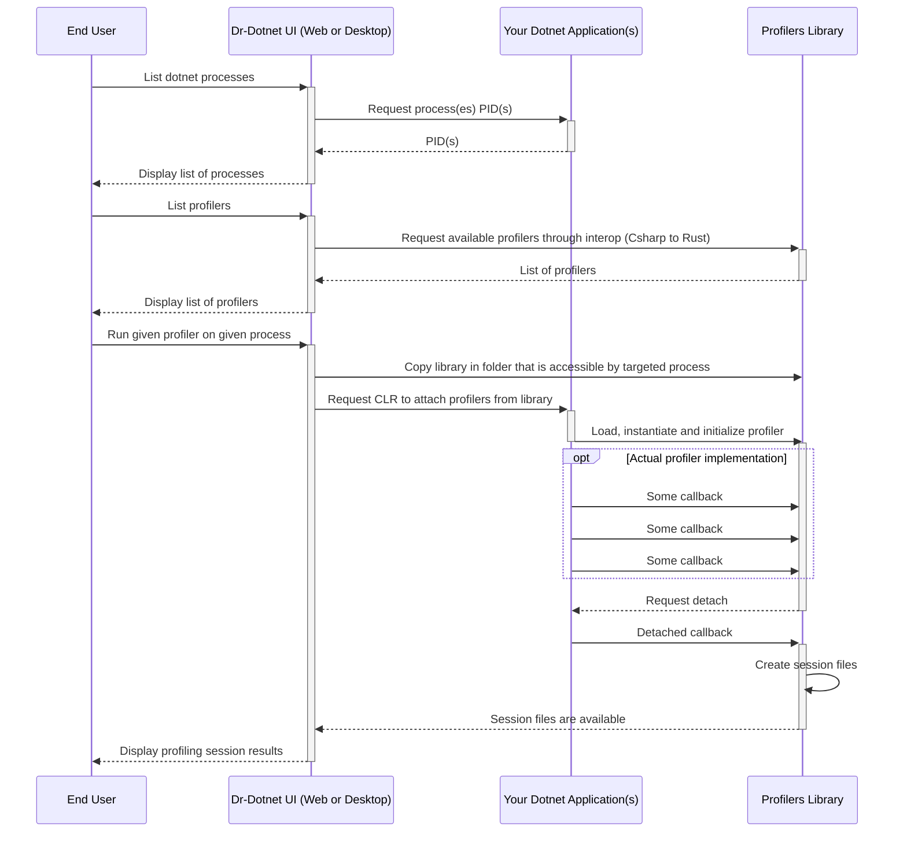

# Dr-Dotnet


    


Dr-Dotnet is a modern profiler for .NET
### Features
- Problem-focused
- Cross-platform
- Works both locally and remotely (well suited for both desktop and server applications)
- Low overhead
- Outputs lightweight, shareable and human-readable reports

While traditional profilers often generate substantial amounts of data, making the process of identifying issues a complex task, Dr-Dotnet takes a different route. It is designed to help pinpoint root causes for problems such as memory leaks, deadlocks, CPU hotpaths, zombie threads, or stuck tasks. This approach aims to simplify the process of troubleshooting common issues and provides analysis results that are often compact enough to be summarized in a few lines or a table.

Furthermore, unlike many traditional profiling tools, Dr-Dotnet offers the possibility of remote profiling. This for instance allows developers to profile production containerized microservices from their laptops. This also enables profiling sessions to be historized and shared with teammates with a simple link. 


# Getting Started

There are two ways to use Dr-Dotnet:
- As a **desktop application**, for profiling local dotnet applications
- As a **web application**, shipped as a docker container, for profiling remote dotnet applications

## Using the desktop version

Check out the [Releases](https://github.com/dr-dotnet/dr-dotnet/releases) to download the latest version of Dr-Dotnet for your platform.

The desktop application is a standalone executable bundled in a .zip file. Extract the archive and run the executable.

> **Note**
> The binaries are currently unsigned. That can be an issue for MacOS which, by default, prevents unsigned binaries from running.

## Using the web app version

Official docker images are available on [Docker Hub](https://hub.docker.com/r/drdotnet/web/tags).

To be able to profile a remote dotnet application, you need to run Dr-Dotnet as a docker side-car, meaning that it would run on the same host as the application you want to profile, but as a separate container. 

For Dr-Dotnet to be able to find other dotnet containers running on that same host, both containers must map a shared volume as their `/tmp` folder.

Here is an example of how to set up Dr-Dotnet to profile a dotnet application running in a docker container:

- Create a volume (we choose to name it `diagnostics` here):
```bash
docker volume create diagnostics
```
- Run your app, with the volume mounted as `/tmp`:
```bash
docker run -v diagnostics:/tmp <YOUR APP IMAGE>
```
- Then, you are ready to start Dr-Dotnet:
```bash
docker run -d --name drdotnet -v diagnostics:/tmp -p 8000:92 drdotnet/web:latest
```
Then go ahead and open your browser at `http://localhost:8000`

> **Note**
> When not used, the only overhead from leaving a Dr-Dotnet container alive are the few MBs of memory it uses (mostly because of the dotnet runtime). It is safe to leave it running on your host.   

> **Warning**
> Make sure the port is private to your network for security reasons, you don't want your profiler to be open to the public.

## Using web app version - Kubernetes

This is possible, but currently, the workflow is a little rough. We are working on making it easier. Please come back later :)

## Rest API
DrDotnet Web also exposes a REST API. A quite common use case is to trigger a profiling session when an issue is detected automatically. For instance, if a metric reports a likely memory leak, a memory leak analysis can be triggered automatically immediately and analyzed later by developers from the UI.

### Endpoints
Here are the REST endpoints for consuming DrDotnet Web REST API:
- POST `/api/sessions` Start a new session
- GET `/api/sessions` Return previous sessions
- GET `/api/sessions/{guid}` Return session for given guid
- GET `/api/sessions/{guid}/download` Return session reports as .zip for given guid
- GET `/api/processes` Return list of processes available to profile
- GET `/api/profilers` Return list of profilers available

In development, you can launch the Web app and navigate to http://localhost:92/swagger to find the Swagger UI with accurate and complete documentation of the API.

### Configuration
The REST API is enabled by default, but it can be disabled through an environment variable or a CLI argument. The UI can also be disabled, for instance, if you want to use DrDotnet exclusively for its REST API.
- `WEB_UI_ENABLED=false` or `--no-web-ui` arg will disable web UI (only REST API)
- `REST_API_ENABLED=false` or `--no-rest-api` arg will disable REST API (only web UI)

# Profiling guidelines

Dr-Dotnet's approach to profiling is an analogy to visiting the doctor: you usually expose your symptoms (headache, cough, ...) to a doctor, and he makes his short and human-readable diagnosis.

In the context of a dotnet application, the symptoms are unwanted things you can observe from simple metrics (high CPU usage, memory leak, ...). From that observation, by using the right profiler(s), Dr-Dotnet will output a short and problem-focused diagnosis.

## What profiler to use?

Here are some non-exhaustive recommendations on what to do depending on observations:
| Observations | Profiler to use | Additional recommendations |
|---|---|---|
| Gen 2 memory increases over time, and hardly only goes down with a restart. This is a sign of a **memory leak**. | GC Survivors | GC Survivors profiler will list objects in Gen 2 along with their most prominent retention paths. With this, any substantial memory leak should be visible: a high number of leaked objects will show up, and a very large object leaking as well (a lot of bytes will be retained) |
| CPU usage is (abnormally) high | CPU Hotpaths | This profiler will walk through every thread stackframe at a fixed time interval. This "sampled" approach provides a relatively accurate view of where the CPU time is spent the most. Unlike many profilers using this method, it will also attempt to unlist suspended threads to display actual hotpaths with more accuracy. |
| Thread starvation</br>High number of pending work item</br>Suspected deadlock | Merged Call Stacks | A merged call stacks view will show where each thread is at, merged by common call stacks. With this you should be able to see if a large number of threads are stuck on a given operation |
| High 95p / 99p latency on a web API but low average latency | Runtime Pauses | It is likely that your application is spending a lot of time in GC. Pauses for GC may be rare, very long pauses can destroy your 95p / 99p SLOs. Runtime Pauses will show you the GC pauses and their duration. This won't help you find the root cause, but it might help you confirm this hypothesis. If you do observe long pauses, then you may want to check the "High allocation rate" case |
| High memory usage for an app that deals with a lot of strings | Duplicated Strings | It is common for a dotnet app to have duplicated strings in memory (two or more strings with the same value, thus occupying more space than a single one would require). Use this profiler to see how much memory is wasted from such strings. The profiler will display their value, hopefully, it will help you find where these strings belong to begin your optimization work. A common solution is [string interning](https://learn.microsoft.com/en-us/dotnet/api/system.string.intern?view=net-7.0). |
| High memory usage | GC Survivors | The GC survivors profiler will display major retention paths for gen 2 objects, along with retained bytes. This should help you identify which parts of your application use the most memory without needing to dump the whole memory. |

## Need to go deeper?

DrDotnet will make it easy to pinpoint common issues, but sometimes, you need to go deeper. In that case, you can use the following tools/resources:
- [mem-doc by Maoni Stephens](https://github.com/Maoni0/mem-doc/blob/master/doc/.NETMemoryPerformanceAnalysis.md) for in-depth memory performance analysis
- [dotnet-trace](https://docs.microsoft.com/en-us/dotnet/core/diagnostics/dotnet-trace) for in-depth CPU time analysis
- [dotnet-dump](https://docs.microsoft.com/en-us/dotnet/core/diagnostics/dotnet-dump) for in-depth memory analysis
- [JetBrains dotMemory (commercial)](https://www.jetbrains.com/dotmemory/?source=google&medium=cpc&campaign=12509621702&term=dotmemory&content=504866862913&gad=1&gclid=CjwKCAjwp6CkBhB_EiwAlQVyxSKUJ6qk5EIm18hjQzuar_1wT-todzOGCkCQwu3Z6jZWvF_Bxg0d1hoCm0UQAvD_BwE)

# Contributing

## How to contribute

- Make a Github issue
  - If you observed a bug, please indicate the reproduction steps and the Dr-Dotnet version you were using.
  - If you want to propose changes or new features
    - Checkout the [Project Spirit](#project-spirit)
    - If you want to propose a Pull Request
      - Check out the [architecture](#architecture) and the [building guidelines](#building) to get started
      - Make sure it builds and that tests are passing
      - Don't mix topics in a PR. One PR addressed one topic (eg: code formatting is one topic, fixing a bug is another)
      - Check out the [CI/CD](#ci--cd) for more information on how versioning and releases work.

## Project Spirit

Dr-Dotnet's goal is to fill the gap between doing *no profiling at all* and *spending countless hours on analyzing huge dumps and traces*. Thus, it is not a replacement for existing tools (WinDbg, Perfview, ...), and never it will be.     
Here are some of the most important values behind this project. The relevance of a new profiler or a feature request will be evaluated accordingly.

### Problem Focused

Usually, when it comes to profiling (with traces or memory dumps for instance), we have an objective in mind: we might have observed an unusual amount of memory usage and want to track down a memory leak, or find hot paths to optimize CPU usage, or debug a deadlock observed in production.   
**Every profiler in Dr-Dotnet is aimed at helping solve a specific issue** that could have been observed without profiling (from common observability means like a CPU metric for instance).    
Some examples are: Finding deadlocks, Detecting memory leaks, Listing CPU hotpaths, ...

### Concise

The tool should be relatively easy to use, meaning mainly two things:
- **The less parametrization we have, the better it is**. Parametrization introduces complexity and confusion to the user. If some parameter must be introduced, it must be justified, documented and set with an adequate default value for the most common scenario.
- **A profiler output must be as concise as possible**. This is not easy, because we are often tempted to output too much information, thinking that "it could be useful".    
For instance, if a profiler displays the total time spent in GC but also the longest GC pause, it could be refactored into two distinct profilers (even if the implementation won't differ much), because a high time spent in GC and a long GC pause time are two different observations.

### Performance

**Having as little overhead as possible is very important**. If the program is altered too much, the analysis may become biased. Choose wisely your profiling API keywords (some are very expensive computationally speaking) and, if possible, to the processing outside of the callbacks, ideally even once the profiler is detached.

## Architecture

### Overview

The .NET Profiling API is accessible via COM interop (cross-platform thanks to the Platform Adaptation Layer) and allows little overhead profiling compared to other methods while giving a wide range of possibilities for profiling purposes.     

In this Dr-Dotnet, we're using **Rust** for coding the profilers for the safety and modernity of the language. The CLR profiling API rust binding are originally taken from [this project from Camden Reslink](https://github.com/camdenreslink/clr-profiler) who did a really great job.    
The UI and profilers management are coded in C#, for the productivity the language offers and because it is convenient for interoperability with Rust. Bindings between C# and Rust are autogenerated using [FFIDJI](https://github.com/ogxd/ffidji) (but they are fairly trivial for now, to be honest, this is probably overkill).

Here is a diagram of the profiling workflow:


The following sections will cover some part of that workflow more in depth.

### C# / Rust Interoperability

The interoperability between the C# app and the Rust profilers is done with autogenerated bindings thanks to [FFIDJI](https://github.com/ogxd/ffidji).
The file `src/DrDotnet.Interop/Interop.xml` describes the Rust methods that the C# app can call, along with all its associated types.    
Based on this definition, FFIDJI will generate `Interop.cs` and `Interop.rs`.

#### How to make changes to bindings?
- If you are on Windows, the FFIDJI executable is included at `src/DrDotnet.Interop/ffidji.exe`.  
Otherwise, you must clone https://github.com/ogxd/ffidji and build it.
- Run `ffidji -f csharp Interop.cs -t rust interop.rs -i Interop.xml`
- Copy `interop.rs` to `src/DrDotnet.Profilers/` (and replace).  
Code generation will only generate types and method signatures, so the rust method implementations must be done manually.  
The C# one is automatically updated so there is nothing to do on this side.

  | WARNING: Remember that this interoperability loads the profilers library in the DrDotnet process, not in the profiled process, so you cannot set variables in memory to use them during the profiling session |
  | ------------------------------------------------------------------------------------------------------------------------------------------------------------------------------------------------------------- |

### Loading, instantiating and initializing the profilers library

To be documented.

### Docker subtleties

To be documented.

### The Rust bindings on the CLR profiling API

To be documented.

## Building

### Prerequisites

- .NET SDK 7.0
- Rust toolchain
- *Recommended OS*: Any desktop platform you'd like (Windows / Linux / MacOS ARM64 or Intel)
- *Recommended IDE*: Any of Visual Studio, Visual Studio Code or JetBrains Rider. Make sure you have both C# and Rust LSP for a comfortable experience, with everything in a single IDE.

### How to build

As Dr-Dotnet is a hybrid C# / Rust project, it makes little sense to build the C# and Rust parts separately.
The recommended workflow is the following:
- Clone the repository
- Open `src/DrDotnet.sln` in your IDE
- Build either `DrDotnet.Web.csproj`, `DrDotnet.Desktop.csproj`, or the solution `DrDotnet.sln`, depending on how you plan to use Dr-Dotnet.

The `DrDotnet.csproj` project has a prebuild step that will try to build the Rust profilers. If it fails, you'll find the Rust compiler output in the Output window for instance if you are using Visual Studio. You usually don't need to use cargo commands yourself directly at this first stage.

You can also simply use dotnet build or dotnet run if you are more of a CLI person 😊

## How to create new profilers

The `DrDotnet.sln` links to the Rust part which is ann in the `src/DrDotnet.Profilers` directory.   
The Rust codebase is divided into two projects:
- `profilers` is where all profilers are
- `profiling_api` is where CLR profiling API bindings are (it wraps the unsafe pointed-based C syntax and brings some safety and convenience to it)

To create a new profiler, check out `src/DrDotnet.Profilers/profilers/src/profilers/` and checkout any profiler. You can duplicate one and change its UUID (make it unique). Then, head to `src/DrDotnet.Profilers/profilers/src/lib.rs/` and add the new profiler to the `register!` macro. Then you're good to go, you can now start using the CLR Profiling API. Check out [the official documentation to get started](https://learn.microsoft.com/en-us/dotnet/framework/unmanaged-api/profiling/profiling-interfaces).
I also recommend checking our [Christophe Nasarre blog posts](https://chnasarre.medium.com/start-a-journey-into-the-net-profiling-apis-40c76e2e36cc) for a more "friendly" introduction to this API ;)    

Note: You'll need to set `is_released` in your profiler to true if you want to be able to view your profiler in the C# UI when built in release mode.    
Another note: DrDotnet attaches to an already running process, meaning that not all callbacks are usable, only those that can be enabled after attaching. See the flags [here](https://learn.microsoft.com/en-us/dotnet/framework/unmanaged-api/profiling/cor-prf-monitor-enumeration) and [here](https://learn.microsoft.com/en-us/dotnet/framework/unmanaged-api/profiling/cor-prf-high-monitor-enumeration).

### Useful Links

If you take on an adventure to develop/improve profilers, here are a few useful links to get into the swing of things:

- [Pavel Yosifovich — Writing a .NET Core cross platform profiler in an hour](https://www.youtube.com/watch?v=TqS4OEWn6hQ)
- [Pavel Yosifovich — DotNext Moscou 2019 Source Code](https://github.com/zodiacon/DotNextMoscow2019)
- [Josef Biehler - Create a .NET profiler with the Profiling API](https://dev.to/gabbersepp/create-a-net-profiler-with-the-profiling-api-start-of-an-unexpected-journey-198n)
- [Mattias Högström - Building a Mixed-Mode Sampling Profiler](https://www.codeproject.com/Articles/384514/Building-a-Mixed-Mode-Sampling-Profiler)
- [Christophe Nasarre - Start a journey into the .NET Profiling APIs](https://chnasarre.medium.com/start-a-journey-into-the-net-profiling-apis-40c76e2e36cc)
- [Some random COM C++ source code](https://github.com/tenable/poc/blob/master/Comodo/Comodo%20Antivirus/ComodoInjectionCode/ComodoInjectionCode/InjectedCode.cpp)
- [Some random COM C++ source code](https://cpp.hotexamples.com/examples/-/ICLRRuntimeInfo/GetInterface/cpp-iclrruntimeinfo-getinterface-method-examples.html)

## CI / CD

### Versioning

Dotnet uses `x.x.x.x` versioning, while Rust uses only `x.x.x`. As a product, we chose to use `x.x.x.x` for versioning Dr-Dotnet. The first three numbers are for the version, and the fourth number is reserved for the build number which is automatically incremented on every commit. Since this is automatic, tag for creating releases should only be `x.x.x`.

During a build, the dotnet solution will look for `VERSION` and `BUILD_NUMBER` environment variables.
- When triggering cargo build, `build.rs` will look for `VERSION` for versioning the rust binary
- Dotnet will look for `VERSION.BUILD_NUMBER` for versioning the C# libraries.

In the Dr-Dotnet UI, the version is displayed in the header. That version is taken from the managed assembly (so it includes the build number).

### How to test/experiment

Follow the [building guidelines](#building) to build the project. Then you should already be able to test and experiment with things locally, either by starting the desktop or the web version.

Release candidates and other experimental versions can be pushed to Docker Hub by manually triggering a dev deployment on the `on-commit` workflow. This can only happen for non-master branches. The docker image will be tagged `x.x.x.build_id-branch_name` (for instance `0.145.23.1234-my-branch`).

### Release workflow

A release can be made automatically by creating a tag `x.x.x` from the master branch. This will automatically:
- Create a new release on github
- Create a new docker image tagged `x.x` (skip minor version) and `latest`
- Create a new desktop version in .zips for all platforms