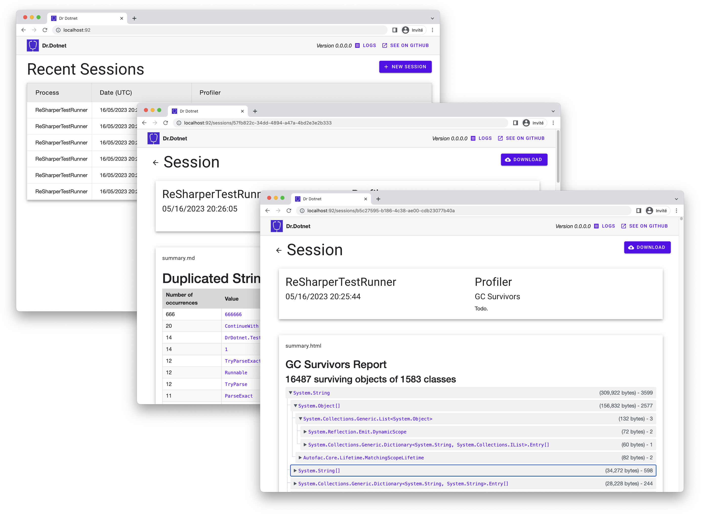

# Dr. Dotnet

    

Dr. Dotnet is a profiling tool for .NET applications, created with a specific vision in mind. It aims to offer an alternative approach to conventional profiling methods, focusing on specific problem areas and providing flexibility for both local and remote profiling.

While traditional profilers often generate substantial amounts of data, making the process of identifying issues a complex task, Dr-Dotnet takes a different route. It is designed to help pinpoint root causes for problems such as memory leaks, deadlocks, CPU hotpaths, zombie threads, or stuck tasks. This approach aims to simplify the process of troubleshooting common issues and provides analysis results that are often compact enough to be summarized in a few lines or a table.

Furthermore, unlike many traditional profiling tools, Dr-Dotnet offers the possibility of remote profiling. This for instance allows developers to profile production containerized microservices from their laptops. This also enables profiling sessions to be historized and shared with teammates with a simple link. 

### Manual
  - **[Getting Started](docs/manual/getting-started.md)**
  - [Guidelines](docs/manual/guidelines.md)
  - [F.A.Q.](docs/manual/faq.md)

### Profilers
  - [CPU Hotpaths](docs/profilers/cpu-hotpaths.md)
  - [Duplicated Strings](docs/profilers/duplicated-strings.md)
  - [GC Survivors](docs/profilers/gc-survivors.md)
  - [Merged Call Stacks](docs/profilers/merged-call-stacks.md)
  - [Runtime Pauses](docs/profilers/runtime-pauses.md)
  - [Thrown Exceptions](docs/profilers/thrown-exceptions.md)

### Contributing
  - [Contributing](docs/contributing/contributing.md)
  - [Architecture](docs/contributing/architecture.md)
  - [Building](docs/contributing/building.md)
  - [Developing Profilers]()
  - [Code of conduct](docs/contributing/code-of-conduct.md)
  - [Licensing](LICENSE.md)